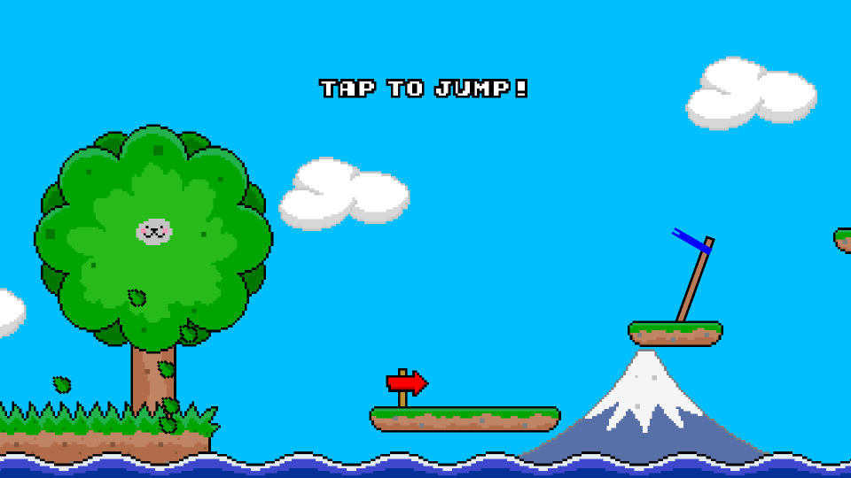

## About
A creative programmer who is passionate to explore his imagination, discover new ideas and turn them into a reality using the wonders of computer science.

## Creations
### Pineapple Game Engine
Coming soon...

### Ninja Cat
**[Available for free on Google Play](https://play.google.com/store/apps/details?id=com.pineapple.ninjacat)**

Ninja Cat is an addictively cute endless runner arcade game with engaging achievements and competitive leaderboards. It was developed in the Pineapple Game Engine in C++.

  

### Libraries
 - [Unformat](./Unformat/) Extremely fast type-safe parsing for C++14/C++17 (300x faster than std::regex)
 - [Obfuscate](./Obfuscate/) Guaranteed compile-time string literal obfuscation header-only library for C++14

## Timeline
 - 2012 Graduated at the University of Warwick - Computing Systems Bsc, 1st Class Honours Bsc
 - 2012 Internship at Havok (Dublin, Ireland)
 - 2013 Software Engineer at G-Research (London, England)
 - 2015 Developer Relations Engineer at Havok (Tokyo, Japan)

## Contact
Please contact me through [LinkedIn](https://www.linkedin.com/in/adam-yaxley-53249442/)
