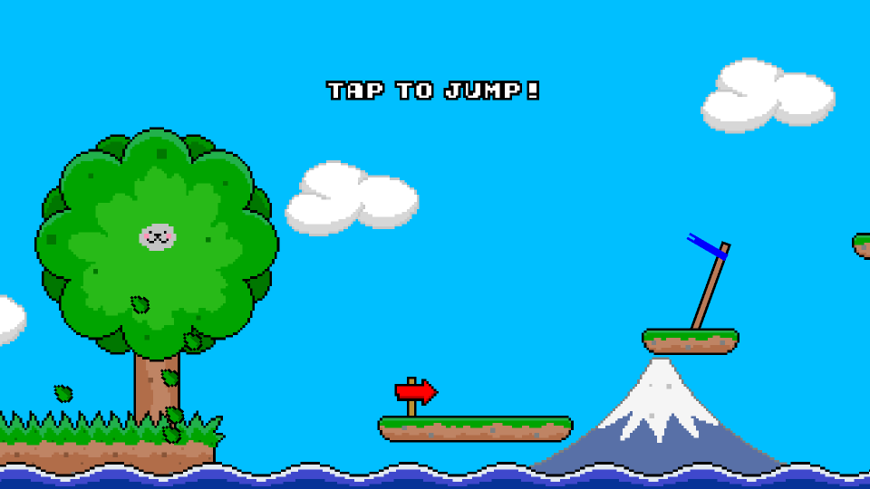

# About
A creative programmer who is passionate to explore his imagination, discover new ideas and turn them into a reality using the wonders of computer science.

# Creations

## Ninja Cat
Ninja Cat is an addictively cute but difficult endless runner arcade game with engaging achievements and competitive leaderboards. It was developed in the Pineapple Game Engine in C++.

Download now ([Apple App Store](https://apps.apple.com/app/apple-store/id908844949?pt=95940764&ct=AdamYaxley&mt=8) | [Google Play](https://play.google.com/store/apps/details?id=com.pineapple.ninjacat))

  

## Libraries
 - [Obfuscate](./Obfuscate/) Guaranteed compile-time string literal obfuscation header-only library for C++14
 - [Unformat](./Unformat/) Extremely fast type-safe parsing for C++14/C++17 (300x faster than std::regex)

# Timeline
 - 2003 Started making own games at age 12
 - 2012 Graduated at the University of Warwick - Computing Systems, 1st Class Honours Bsc
 - 2012 Internship at Havok (Dublin, Ireland)
 - 2013 Software Engineer at G-Research (London, England)
 - 2015 Developer Relations Engineer at Havok (Tokyo, Japan)
 - 2017 Developer Relations Engineer 2 at Havok (Microsoft) (Tokyo, Japan)
 - 2020 Senior Developer Relations Engineer at Havok (Microsoft) (Tokyo, Japan)

# Contact
Please contact me through [LinkedIn](https://www.linkedin.com/in/adam-yaxley-53249442/)
